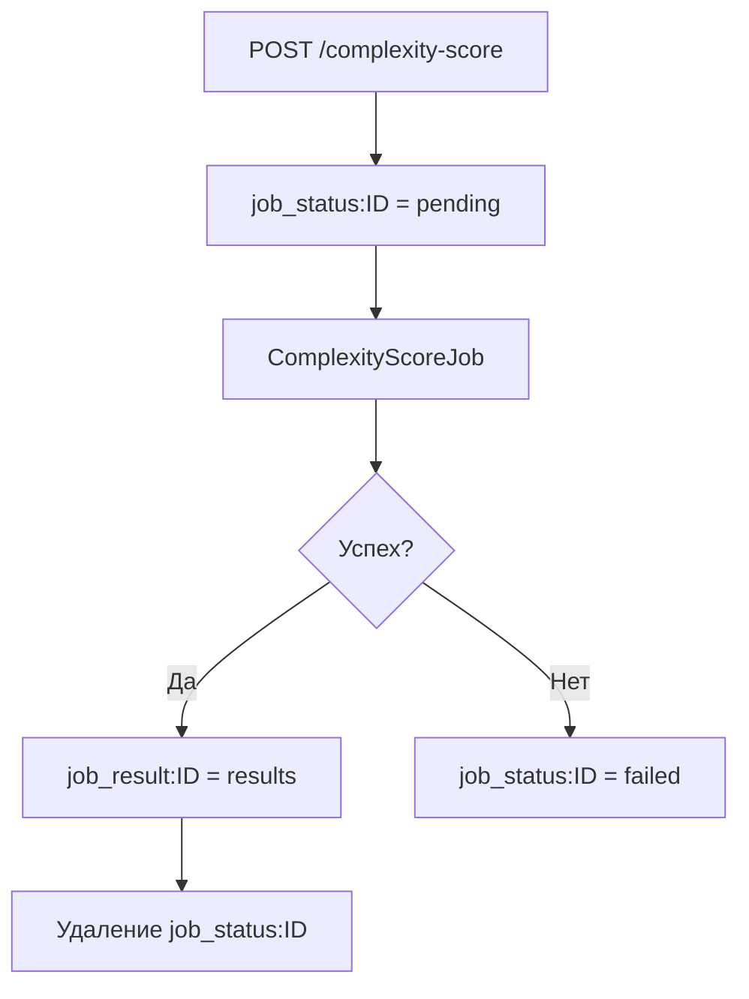
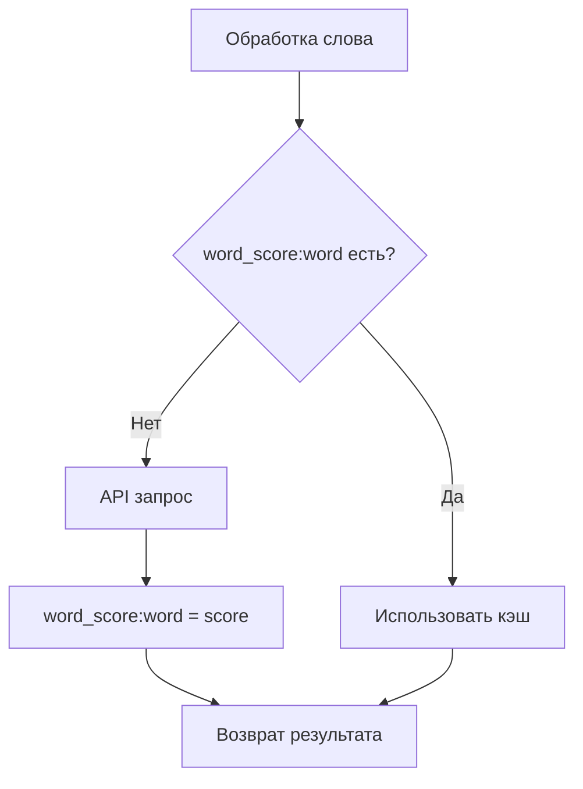

# Redis Schema

## Схема данных

### 1. Статус джобов
**Ключ:** `job_status:{job_id}`  
**TTL:** 6 часов  
**Значения:** `pending` | `failed`

```
job_status:abc123def456 → "pending"
job_status:xyz789uvw012 → "failed"
```

### 2. Результаты джобов
**Ключ:** `job_result:{job_id}`  
**TTL:** 6 часов  
**Формат:** JSON Hash

```json
job_result:abc123def456 → {"happy": 2.5, "sad": 1.0}
```

### 3. Кэш сложности слов
**Ключ:** `word_score:{word}`  
**TTL:** 1 день  
**Формат:** Float

```
word_score:happy → 2.5
word_score:hello → 0.75
```

### 4. Кэш батчей
**Ключ:** `batch:{hash}`  
**TTL:** 6 часов  
**Формат:** JSON Hash

```json
batch:a1b2c3d4e5f6 → {"word1": 1.5, "word2": 2.0}
```

## Жизненный цикл



## Кэширование слов



## Особенности

### TTL (Time To Live)
- **Джобы:** 6 часов - баланс доступности/очистки
- **Слова:** 1 день - долгосрочное кэширование

### Автоочистка
- Успешные джобы: `job_status` удаляется автоматически
- Redis: автоматическое удаление по TTL
- Нет race conditions

## Мониторинг

### Redis команды
```bash
# Просмотр ключей
KEYS job_status:*
KEYS job_result:*  
KEYS word_score:*
KEYS batch:*

# Проверка TTL
TTL job_status:abc123

# Содержимое
GET job_status:abc123
GET word_score:happy
```

### Метрики
- Количество активных джобов (`job_status:*`)
- Размер кэша слов (`word_score:*`)
- Hit rate кэша
- Средний TTL ключей

## Примеры использования

### Новый запрос
```
1. POST → job_status:a1b2c3d4 = "pending"
2. Job обрабатывает слова
3. word_score:happy = 2.5 (TTL: 1d)
4. job_result:a1b2c3d4 = {"happy": 2.5} (TTL: 6h)
5. Удаление job_status:a1b2c3d4
```

### Повторный запрос (кэш)
```
1. POST → job_status:x9y8z7w6 = "pending" 
2. "happy": найдено в word_score:happy = 2.5 (кэш хит)
3. "joy": API запрос → word_score:joy = 3.2
4. job_result:x9y8z7w6 = {"happy": 2.5, "joy": 3.2}
```

### Ошибка
```
1. POST → job_status:xyz123 = "pending"
2. Job падает с ошибкой  
3. job_status:xyz123 = "failed" (TTL: 6h)
4. GET → {"status": "failed"}
```

## Производительность

- **Hit rate** для `word_score:*` снижает API запросы
- **TTL 1 день** для слов обеспечивает переиспользование  
- **TTL 6 часов** для джобов предотвращает накопление
- **Атомарные операции** предотвращают race conditions